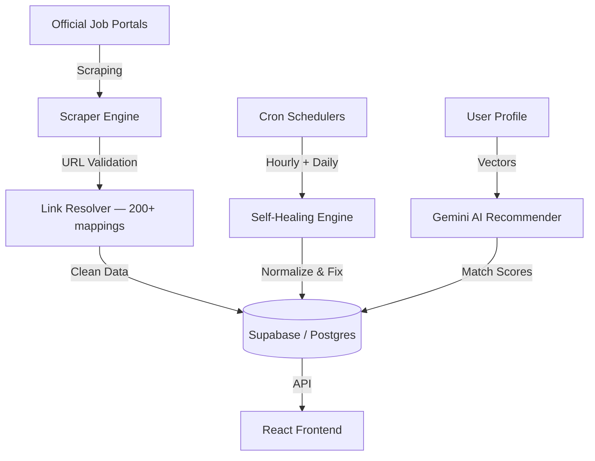

<p align="center">
  
</p>

<h1 align="center">SarkarHamariHai — सरकार हमारी है</h1>

<p align="center">
  <strong>India's smartest government job & exam aggregator.</strong><br/>
  Real data. Real official links. Zero placeholders.
</p>

<p align="center">
  🌐 <strong><a href="https://sarkarhamarihai.app">sarkarhamarihai.app</a></strong>
</p>

<p align="center">
  <a href="LICENSE"></a>
  <a href="https://react.dev/"></a>
  <a href="https://tailwindcss.com/"></a>
  <a href="https://deepmind.google/technologies/gemini/"></a>
  <a href="https://supabase.com/"></a>
  <a href="https://vercel.com/"></a>
</p>

---

## What is this?

SarkarHamariHai is a secure, high-performance aggregator for competitive exams and government careers across India (covering UPSC, SSC, Railways, Banking, Defense, Teaching, and State PSCs). It aggregates verified listing details, filters out generic redirect links, and helps aspirants focus on preparation through custom-tailored syllabus mappings, study trackers, and daily schedulers.

---

## Core Features

### 1. AI Syllabus Synergy Matcher
- **Curriculum Comparison:** Runs semantic overlap analyses comparing your applied exam targets against potential companion exams.
- **Harmony Breakdown:** Identifies concept alignment percentages, listing shared chapters, missing modules, transition difficulty gaps (Low/Medium/High), and estimated additional study time required.
- **Transition Roadmap:** Suggests week-by-week preparation paths for compatible exams to help you optimize study strategies.

### 2. AI Daily Study Planner & Scheduler
- **Time-Slot Allocation:** Dynamically schedules your day between wake and sleep times based on target study hours.
- **Subject-Level Resolution:** Reads target exams and automatically resolves generic exam titles into actual topics (e.g., *History*, *Geography*, *Polity*, *Quantitative Aptitude*) for study blocks.
- **Evening Debriefs:** Delivers direct daily coaching reviews and encouragement based on completed study sessions.

### 3. Self-Healing Data Pipeline
- **Sanitization:** Cleans data daily to replace placeholder salaries, normalize start/end dates, format job titles, and resolve duplicate postings.
- **Stable Pagination:** Utilizes cursor-style pagination in data cleaning scripts to prevent row skips during updates.

### 4. Official Domain Link Resolver
- **Extension Verification:** References over 200 official central and state government domain patterns (e.g., `*.nic.in`, `*.gov.in`) to verify scraped sources.
- **Ad/Phishing Filter:** Prevents link rot and generic redirects, mapping pages directly to verified PDFs, official websites, or portals.

### 5. Progress & Readiness Analytics
- **Readiness Score:** Computes overall preparation benchmarks using a weighted formula (40% syllabus completion, 25% weekly study consistency, 20% average productivity, and 15% streak bonus).
- **Streak & Percentiles:** Tracks continuous study chains and calculates weekly ranking/percentiles against benchmark targets.
- **Clearance Probability:** Calculates likelihood metrics for matching targets using multivariate logistic regression approximations (factoring in streaks, syllabus coverage, mock ratio, and exam countdowns).

### 6. Localized Multi-Language Interface
- Supports translation maps across **11 Indian languages**:
  - English, Hindi (हिन्दी), Tamil (தமிழ்), Telugu (తెలుగు), Bengali (বাংলা), Marathi (मराठी), Kannada (ಕನ್ನಡ), Malayalam (മലയാളം), Gujarati (ગુજરાતી), Punjabi (ਪੰਜਾਬੀ), and Odia (ଓଡ଼ିଆ).

---

## Technical Architecture



---

## Technology Stack

- **Frontend** — React 19, Vite, Tailwind CSS v4, Framer Motion, Redux Toolkit
- **Backend** — Node.js (CommonJS), Express, Vercel Serverless Functions
- **Database** — PostgreSQL via Supabase DB Adapter (pg TCP pool with REST fallback)
- **AI Core** — Google GenAI SDK (`@google/genai` Gemini 2.5), Vertex AI, Nvidia GLM 5.2 Fallback
- **Scheduling** — Cron-Job.org / Vercel Serverless Crons

---

## Directory Structure

```
├── api/              Vercel serverless endpoints + cron handlers
├── backend/
│   ├── src/
│   │   ├── engines/  Link resolver, data healer, eligibility engine, sync core
│   │   ├── routes/   Express API routes (tracker, auth, jobs, syllabus, etc.)
│   │   ├── services/ Gemini AI, translation helper, database config
│   │   └── scrapers/ UPSC, SSC scrapers extending base classes
│   └── scripts/      Database maintenance utilities
├── src/
│   ├── components/   React UI modules & Tracker views
│   ├── pages/        Dashboard, LoginPage, TrackerPage, and details routes
│   ├── store/        Redux slices (auth, UI states)
│   ├── i18n/         Multi-language dictionary and context providers
│   └── utils/        Supabase wrappers, translation converters
├── scripts/          Verification, healer, and audit scripts
├── supabase/         PostgreSQL schema, indices, and database migrations
└── public/           Assets and logo resources
```

---

## Getting Started

### 1. Installation
Clone the repository and install the project dependencies:
```bash
git clone https://github.com/aayushverma246-ai/sarkarhamarihai.git
cd sarkarhamarihai
npm install
```

### 2. Environment Variables
Create a local environment file:
```bash
cp .env.example .env
```
Provide the required configurations in `.env`:
- **Supabase credentials** (URL, anon key, service role key, DB password)
- **JWT secrets**
- **Gemini API key** (`GEMINI_API_KEY_NEW`)

### 3. Database Initialization
Seed the databases with initial mock exams and schemas:
```bash
npm run seed
```

### 4. Running Development Servers
Spin up both the Vite client server and Node Express backend server in parallel:
```bash
npm run dev
```
- Frontend client runs at `http://localhost:5173`
- Backend API runs at `http://localhost:3001`

### 5. Running Code & Data Auditing
Perform a comprehensive integrity and structure audit against all active database records:
```bash
npm run migrate
```

---

## Contributing

1. Fork this repository.
2. Create a specific feature branch (`git checkout -b my-feature`).
3. Commit your changes.
4. Push the branch and open a Pull Request.

---

## License

This project is licensed under the MIT License — see the [LICENSE](LICENSE) file for details.
