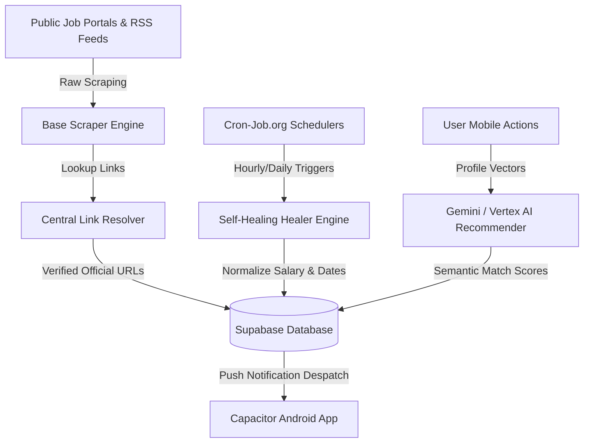

# 🏛️ SarkarHamariHai (सरकार हमारी है)

<p align="center">
  
</p>

<h3 align="center">SarkarHamariHai — Smart Indian Government Jobs & Examinations Aggregator</h3>

<p align="center">
  An AI-powered digital ecosystem and cross-platform mobile application designed to aggregate, sanitize, and personalize government examinations and job openings across India.
</p>

<p align="center">
  <a href="LICENSE"></a>
  <a href="https://react.dev/"></a>
  <a href="https://tailwindcss.com/"></a>
  <a href="https://capacitorjs.com/"></a>
  <a href="https://deepmind.google/technologies/gemini/"></a>
  <a href="https://supabase.com/"></a>
  <a href="https://vercel.com/"></a>
  <a href="https://nodejs.org/">= 18" /></a>
  
</p>

---

## 🚀 Key Highlights

*   **🧠 AI Recommender Engine**: Utilizes Google Gemini and Vertex AI semantic vector search to match applicant educational profiles and qualifications with open exam positions.
*   **🛡️ Production Data Guardrails**: Integrated centralized link resolver maps all scraped sources to official government portals. Deterministic self-healing engines ensure exactly `0` placeholder scales or broken configurations.
*   **📱 Native Mobile Portals**: Fully integrated cross-platform builds wrap React 19 into Android SDK components via Capacitor Core, supporting push notification queues.
*   **🌐 Regional Localization**: Dynamic UI translations with complete support for English, Hindi (हिन्दी), and Marathi (मराठी).
*   **⚡ Real-Time Tracking**: Interactive applicant dashboard to trace registration dates, fee closures, and application status.

---

## 📐 System Architecture & Data Flow

SarkarHamariHai implements a structured pipeline of scrapers, validators, and schedulers to maintain 100% data freshness:



---

## 🛠️ Tech Stack

*   **Frontend**: React 19, Vite, Tailwind CSS v4, Framer Motion, Redux Toolkit.
*   **Backend**: Node.js, Express, Vercel Serverless Architecture.
*   **Database**: PostgreSQL (via Supabase Client & Connection Pool).
*   **Mobile Framework**: Capacitor Native SDK Wrapper.
*   **AI Engine**: Google Generative AI SDK (Gemini) & GCP Vertex AI.
*   **Scheduler**: Cron-Job.org REST API Integrations.

---

## ⚙️ Setup & Installation

### 1. Configure Environment Variables
Copy the template configuration file to create your local `.env`:
```bash
cp .env.example .env
```
Fill in the variables inside `.env` with your JWT secrets, Supabase API keys, and Google Gemini API keys.

> [!WARNING]
> Environment variables must be kept secure. Never commit `.env` files to git. They are automatically ignored under the `.gitignore` rules.

### 2. Install Dependencies
```bash
npm install
```

### 3. Database Seeding & Verification
Initialize your Supabase database schema and execute data verification:
```bash
# Seed local or Supabase tables
npm run seed

# Run the data integrity verification engine
npm run migrate
```

### 4. Run Development Servers
Starts the Vite dev server for the React frontend and nodemon for the Express API server concurrently:
```bash
npm run dev
```
The client website will be available at `http://localhost:5173`.

---

## 📱 Mobile App Development (Capacitor Android)

To build and compile the native Android app:

```bash
# Sync Web Build to Android Source
npm run cap:sync

# Compile APK (app-debug.apk)
npm run cap:apk

# Run on Device / Emulator
npm run cap:run
```

---

## 🛡️ Data Quality & Verification Engines

To maintain database integrity in production, the application utilizes three custom engines:

### 1. Centralized Link Resolver
Located in `backend/src/engines/link-resolver.js`, this module contains over 200+ case-insensitive mappings for official portals. It intercepts scraped URLs and resolves them to their correct state PSC, RRB zone, or High Court domain.

### 2. Deterministic Healer
Triggered daily via Vercel Serverless (`/api/cron/healer`), this engine runs a page-by-page database sanitization scan. It:
*   Sets mock/default salary ranges (`15k - 80k`) to `0 - 0` ("Not Specified").
*   Validates states and categorizes exams.
*   Uses stable ordering to prevent Postgres page-skips during background writes.

### 3. Verification Command Suite
*   `npm run migrate` (runs `scripts/full-verification.js`): Performs a deep audit on all records inside Supabase for generic domains, broken links, invalid category flags, and empty values.
*   `node scripts/run-healer.js` : Manually triggers the self-healing data pipeline locally.

---

## 📂 Project Structure

```
sarkarhamarihai/
├── .github/          # GitHub workflow actions
├── android/          # Capacitor native Android app project files
├── api/              # Vercel serverless function entrypoints
├── backend/          # Backend server models, routes, and engines
│   ├── src/          # Express route logic, database connectors, and AI engines
│   └── scripts/      # Data parsers, db audit utilities, and index managers
├── src/              # React frontend application source code
│   ├── components/   # UI widgets, cards, and navigation elements
│   └── store/        # Redux state slices and actions
├── public/           # Static assets, local logos, and images
├── scripts/          # Database migration and system healing helper utilities
├── .gitignore        # Standard Git rule ignores
├── vercel.json       # Vercel deployment routing and configuration
├── vite.config.mts   # Vite build pipelines and plugins
└── package.json      # Node dependency registry and build scripts
```

---

## 🛡️ License

This project is licensed under the MIT License - see the [LICENSE](LICENSE) file for details.
