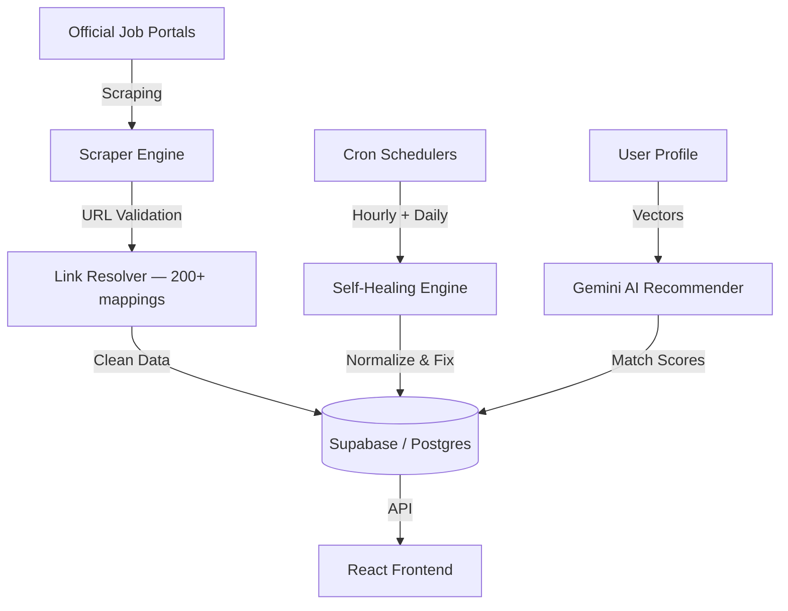

<p align="center">
  
</p>

<h1 align="center">SarkarHamariHai — सरकार हमारी है</h1>

<p align="center">
  <strong>India's smartest government job & exam aggregator.</strong><br/>
  Real data. Real links. Zero placeholders.
</p>

<p align="center">
  🌐 <strong><a href="https://sarkarhamarihai.app">sarkarhamarihai.app</a></strong>
</p>

<p align="center">
  <a href="LICENSE"></a>
  <a href="https://react.dev/"></a>
  <a href="https://tailwindcss.com/"></a>
  <a href="https://deepmind.google/technologies/gemini/"></a>
  <a href="https://supabase.com/"></a>
  <a href="https://vercel.com/"></a>
</p>

---

## What is this?

SarkarHamariHai scrapes, cleans, and organizes government job listings from across India — UPSC, SSC, state PSCs, railways, courts, banking — into one searchable dashboard. Every link points to an official government portal. Every salary, date, and eligibility field is verified by automated engines that run daily.

It's built for students and job seekers who are tired of sketchy aggregator sites full of ads and fake data.

---

## Features

| Feature | Description |
|---|---|
| **AI Recommendations** | Google Gemini matches your profile to relevant exams using semantic vector search |
| **Self-Healing Data** | Automated engines scan the database daily — fix broken links, normalize salaries, validate categories |
| **200+ Official Portals** | Centralized link resolver maps every scraped URL to its correct government domain |
| **Multi-Language** | Full UI support for English, Hindi (हिन्दी), and Marathi (मराठी) |
| **Application Tracker** | Track which exams you've applied to, set reminders for deadlines |
| **Study Planner** | AI-generated daily study plans with progress tracking |
| **Real-Time Updates** | Cron jobs sync new listings every hour from official sources |

---

## Architecture



---

## Tech Stack

- **Frontend** — React 19, Vite, Tailwind CSS v4, Framer Motion, Redux Toolkit
- **Backend** — Node.js, Express, Vercel Serverless Functions
- **Database** — PostgreSQL via Supabase
- **AI** — Google Gemini SDK, Vertex AI
- **Scheduling** — Cron-Job.org

---

## Getting Started

### 1. Clone and install

```bash
git clone https://github.com/aayushverma246-ai/sarkarhamarihai.git
cd sarkarhamarihai
npm install
```

### 2. Set up environment variables

```bash
cp backend/.env.example .env
```

Fill in your Supabase credentials, JWT secret, and Gemini API key.

> [!WARNING]
> Never commit `.env` files. They're already in `.gitignore`.

### 3. Seed the database

```bash
npm run seed
```

### 4. Start development

```bash
npm run dev
```

Frontend runs at `http://localhost:5173`, backend API at `http://localhost:3001`.

---

## Data Integrity

This project takes data quality seriously. Three systems work together:

**Link Resolver** (`backend/src/engines/link-resolver.js`) — 200+ mappings that convert scraped URLs to verified government portal domains.

**Deterministic Healer** (`/api/cron/healer`) — Runs daily. Removes placeholder salaries, validates state assignments, normalizes date formats. Uses stable pagination to avoid skipping rows during updates.

**Verification Suite** — Run `npm run migrate` to perform a full audit of every record in the database.

---

## Project Structure

```
├── api/              Vercel serverless endpoints + cron handlers
├── backend/
│   ├── src/
│   │   ├── engines/  Link resolver, healer, validator, scraper core
│   │   ├── routes/   Express API routes
│   │   ├── services/ Gemini AI, translation, normalization
│   │   └── scrapers/ UPSC, SSC scrapers
│   └── scripts/      Database maintenance utilities
├── src/
│   ├── components/   React UI components
│   ├── pages/        Route pages
│   ├── store/        Redux state management
│   ├── i18n/         Translations
│   └── utils/        Supabase client, helpers
├── scripts/          Verification and healing scripts
├── supabase/         Database schema and migrations
└── public/           Static assets
```

---

## Contributing

1. Fork the repo
2. Create a feature branch (`git checkout -b my-feature`)
3. Commit your changes
4. Push and open a pull request

---

## License

MIT — see [LICENSE](LICENSE) for details.
